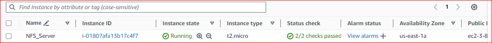
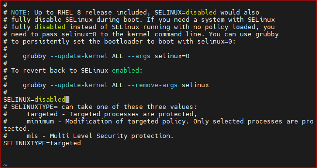
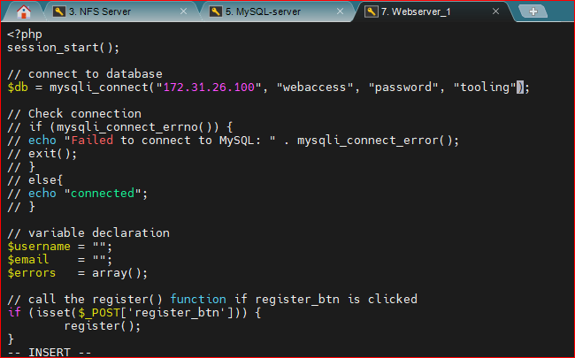

# DEVOPS TOOLING WEBSITE SOLUTION

In this project, I will be implementing a tooling website solution making access to DevOps tools within the corporate infrastructure easily accessible. My solution will consist of the following components.

1. Infrastructure: AWS
2. Webserver Linux: Red Hat Enterprise Linux 8

```
RHEL-8.6.0_HVM-20220503-x86_64-2-Hourly2-GP2 (ami-035c5dc086849b5de)
```

3. Database Server: Ubuntu 20.04 + MySQL
4. Storage Server: Red Hat Enterprise Linux 8 + NFS Server

```
RHEL-8.6.0_HVM-20220503-x86_64-2-Hourly2-GP2 (ami-035c5dc086849b5de)
```

5. Programming Language: PHP
6. Code Repository: GitHub

```
https://github.com/darey-io/tooling
```

## Implement a business website using NFS for the backend file storage

**Step 1: Prepare NFS Server**

1. Spin up a new EC2 instance with RHEL Linux 8 Operating System.



2. Based on my LVM experience from [Project-6](https://github.com/chidbest/DevOps-Repo/tree/main/9_WordPress%20Website%20with%20LVM%20Storage), Configure LVM on the Server.

- Instead of formatting the disks as `ext4` you will have to format them as `xfs`
- Ensure there are 3 logical volumes. `lv-opt`, `lv-apps` and `lv-logs`.
- Create mount points on `/mnt` directory for the logical volumes as follows:

  - Mount `lv-apps` on `/mnt/apps` - To be used by the webservers.
  - Mount `lv-logs` on `/mnt/logs` - To be used by webserver logs
  - Mount `lv-opt` on `/mnt/opt` - To be used by Jenkins server in Project 8

  `sudo gdisk /dev/xvd[fgh]`

3. Install `LVM2` package using the command `sudo yum install lvm2`.

4. Run `sudo lvmdiskscan` command to check for available partitions.


5. Use `pvcreate` utility to mark each of 3 disks as physical volumes (PVs) to be used by LVM

```
sudo pvcreate /dev/xvdf1
sudo pvcreate /dev/xvdg1
sudo pvcreate /dev/xvdh1
```

6. Verify that your physical volume has been created successfully by running `sudo pvs`


7. Use `vgcreate` utility to add all 3 PVs to a volume group (VG). Name the VG webdata-vg

`sudo vgcreate webdata-vg /dev/xvdh1 /dev/xvdg1 /dev/xvdf1`


8. Verify that the VG created successfully by running the command `sudo vgs`

9. Use `lvcreate` utility to create 3 logical volumes. lv-apps, lv-logs and lv-opt which will be used to store website data, log data and jenkins data respectively.

`sudo lvcreate -n lv-apps -L 9G webdata-vg`

`sudo lvcreate -n lv-logs -L 9G webdata-vg`

`sudo lvcreate -n lv-opt -L 9G webdata-vg`

10. Verify that your Logical Volume has been created successfully by running `sudo lvs`


11. Verify the entire setup

`sudo vgdisplay -v` #view complete setup - VG, PV, and LV

`sudo lsblk`


12. Use `mkfs.xfs` to format the logical volumes with xfs filesystem

`sudo mkfs -t xfs /dev/webdata-vg/lv-apps`

`sudo mkfs -t xfs /dev/webdata-vg/lv-logs`

`sudo mkfs -t xfs /dev/webdata-vg/lv-opt`

13. Create directories to mount the logical volumes

`sudo mkdir -p /mnt/apps`

`sudo mkdir -p /mnt/logs`

`sudo mkdir -p /mnt/opt`

14. Mount the logical drives unto the respective directories.

`sudo mount /dev/webdata-vg/lv-apps /mnt/apps/`

`sudo mount /dev/webdata-vg/lv-opt /mnt/opt/`

`sudo mount /dev/webdata-vg/lv-logs /mnt/logs/`


15. Update `/etc/fstab` in this format using your own UUID and remember to remove the leading and ending quotes.

`sudo blkid`


To edit the UUID use `sudo vi /etc/fstab`

```
# mounts for NFS Server
logs: UUID=68ba5691-c849-4487-acc8-c4c9b5a82fab /mnt/logs xfs defaults 0 0
opt: UUID=412d73b6-0a97-4c80-aaec-2b6d80e93e6a /mnt/opt xfs defaults 0 0
apps: UUID=7d078332-ba07-46df-8bc4-b0afa62acccd /mnt/apps xfs defaults 0 0
```


`sudo mount -a`

`sudo systemctl daemon-reload`

`df -h`


16. Install NFS server, configure it to start on reboot and make sure it is up and running.

```
sudo yum -y update
sudo yum install nfs-utils -y
sudo systemctl start nfs-server.service
sudo systemctl enable nfs-server.service
sudo systemctl status nfs-server.service
```


17. Export the mounts for webservers `subnet cidr` to connect as clients. For simplicity I will be installing all 3 webservers inside the same subnet but in production setup you would probably want to seperate each tier inside it's own subnet for higher level of security. To check your `subnet cidr`, open your EC2 details in AWS web console and locate the Networking tab and open a subnet link as shown below:


_Ensure to set up permissions that will allow our Web servers to read, write and execute files on NFS:_

```
sudo chown -R nobody: /mnt/apps
sudo chown -R nobody: /mnt/logs
sudo chown -R nobody: /mnt/opt

sudo chmod -R 777 /mnt/apps
sudo chmod -R 777 /mnt/logs
sudo chmod -R 777 /mnt/opt

sudo systemctl restart nfs-server.service
```

18. Configure access to NFS for clients within the same subnet (example of subnet CIDR - `172.31.16.0/20`)

```
sudo vi /etc/exports

/mnt/apps <Subnet-CIDR>(rw,sync,no_all_squash,no_root_squash)
/mnt/logs <Subnet-CIDR>(rw,sync,no_all_squash,no_root_squash)
/mnt/opt <Subnet-CIDR>(rw,sync,no_all_squash,no_root_squash)

Esc + ZZ

sudo exportfs -arv
```


19. Check which port is used by NFS and open it using Security Groups (add new Inbound Rule)

`rpcinfo -p | grep nfs`


_Important note: In order for NFS server to be accessible from your client, you must also open the following ports:_

- TCP 111
- UDP 111
- UDP 2049


## Configure Backend Database as part of 3 Tier Architecture

**Step 2: Configure the database server. Recall how to install and configure a MySQL DBMS to work with a remote webserver.**

1. Install MySQL server on Ubuntu Linux OS `sudo apt update` and `sudo apt install mysql-server`

2. Create a database and name it `tooling`

3. Create a database user and name it `webaccess`

4. Grant permission to `webaccess` user on `tooling` database to do anything only from the webservers `subnet cidr` which in this case is `172.31.16.0/20`

```
sudo mysql
CREATE DATABASE tooling;
CREATE USER `webaccess`@`172.31.16.0/20` IDENTIFIED BY 'password';
GRANT ALL ON tooling.* TO 'webaccess'@'172.31.16.0/20';
FLUSH PRIVILEGES;
SHOW DATABASES;
exit
```


## Step 3: Prepare the Web Servers

We need to make sure that our web servers can serve the same content from shared storage solutions. In our case - NFS Server and MySQL database. We already know that one DB can be accessed for `reads` and `writes` by multiple clients. For storing files that our web servers will use, we will utilize NFS and mount previously created logical volume `lv-apps` to the folder where Apache stores files to be served to the users `/var/www`

This approach will make our web servers `stateless` which means we will be able to add new ones or remove them whenever we need to and the integrity of the data (in the database and on the NFS) will be preserved.

In this step we will do the following:

- Configure NFS client (this step must be done on all 3 webservers).
- Deploy a Tooling application to our webservers into a shared NFS folder.
- Configure the web servers to work with a single MySQL database.

1. Launch a new EC2 instance with RHEL 8 OS

2. Install NFS client `sudo yum install nfs-utils nfs4-acl-tools -y`

3. Mount `/var/www/` and target the NFS server's export for apps

`sudo mkdir /var/www`

`sudo mount -t nfs -o rw,nosuid 172.31.17.24:/mnt/apps /var/www`


4. Edit `sudo vi /etc/fstab`

Add the following line:

`<NFS-Server-Private-IP-Address>:/mnt/apps /var/www nfs defaults 0 0`

`<NFS-Server-Private-IP-Address>:/mnt/logs /var/log/httpd nfs defaults 0 0`

```
172.31.17.24:/mnt/apps /var/www nfs defaults 0 0

172.31.17.24:/mnt/logs /var/log/httpd nfs defaults 0 0
```


5. Install `Remi's Repository`, Apache and PHP one after the other.

```
sudo yum install httpd -y

sudo dnf install https://dl.fedoraproject.org/pub/epel/epel-release-latest-8.noarch.rpm

sudo dnf install dnf-utils http://rpms.remirepo.net/enterprise/remi-release-8.rpm

sudo dnf module reset php

sudo dnf module enable php:remi-7.4

sudo dnf install php php-opcache php-gd php-curl php-mysqlnd

sudo systemctl start php-fpm

sudo systemctl enable php-fpm

sudo setsebool -P httpd_execmem 1
```

**Repeat steps 1-5 for another 2 Web Servers.**

6. Verify that Apache files and directories are available on the Web Server in `/var/www/` and also on the NFS server in `/mnt/apps`. If you see the same files, it means NFS is mounted correctly. You can try to create a new file `touch test.txt` from one server and check if the same file is accessible from the other webservers.


Creating a new file `test.txt` on `Webserver1: /var/www/`


You can see from the screenshot below that the new file test.txt is visible in `NFSServer: /mnt/apps/`


7. Locate the log folder for Apache on the web server and mount it to NFS server's export for logs.

`sudo mount -t nfs -o rw,nosuid 172.31.17.24:/mnt/logs /var/log/httpd`

Repeat step no. 4 to make sure the mount point will persist after reboot.

Edit `sudo vi /etc/fstab` and insert the code below

```
172.31.17.24:/mnt/apps /var/www nfs defaults 0 0

172.31.17.24:/mnt/logs /var/log/httpd nfs defaults 0 0
```


8. I forked the tooling source code from [Darey.io Github Account](https://github.com/darey-io/tooling) to my GitHub account.

   - I learnt how to create an SSH from [this site](https://www.servers.com/support/knowledge/linux-administration/how-to-create-a-new-ssh-key-pair#:~:text=Linux%20administration&text=To%20create%20a%20new%20SSH%20key%20pair%2C%20run%20the%20%22ssh,in%20the%20Command%20Prompt%20app.) to enable me connect the forked git file to my server.

9. Deploy the tooling website code to the webserver. Ensure that the html folder from the repository is deployed to `/var/www/html`

Install Git on server `sudo yum install git -y`

Registered new SSH key to my GitHub account for the tooling webserver


Now I could successfully clone the forked repo from my github account unto my webserver

`git clone git@github.com:chidbest/tooling.git`

I ensured the contents of the `html` folder was deployed to `/var/www/html`

`sudo cp -R html/. /var/www/html`


**Note 1:** Do not forget to open TCP port 80 on the webservers.


**Note 2:** If you encounter 403 Error - check permissions to your `/var/www/html` folder and also disable SELinux `sudo setenforce 0`. To make this change permanent, open the config file `sudo vi /etc/sysconfig/selinux` and set `SELINUX=disabled`, then restart httpd.



10. Update the website's configuration to connect to the database in `/var/www/html/functions.php` file.

Apply `tooling-db.sql` script to your database using the command `mysql -h <database-private-ip> -u <db-username> -p <db-password> < tooling-db.sql`. This creates a table called `users` with a default `admin user`.

`sudo vi /var/www/html/functions.php`




Apply the `tooling-db.sql` script with the command `sudo mysql -h 172.31.26.100 -u webaccess -p --database=tooling < /home/ec2-user/tooling/tooling-db.sql`

Create in MySQL a new admin user with username: `myuser` and password: `password`

`USE tooling;`

`SHOW tables;`

`INSERT INTO 'users' (id, username, password, email, user_type, status) VALUES (1, 'myuser', '5f4dcc3b5aa765d61d8327deb882cf99', 'user@mail.com', 'admin', '1');`


You can see from the below screenshot the newly added admin user `myuser`


Finally, open the website in your browser `http://<Web-Server-Public-IP-Address-OR-Public-DNS-Name>/index.php` and make sure you can login into the website with `myuser`.


# PROJECT SUCCESSFULLY COMPLETED ON TWO OTHER SERVERS

**NOTE**

Along the way I encountered errors 500 which required me to restart the project from another region on AWS

`cat /var/log/httpd/error_log  - log error` - To check for errors

`sudo journalctl -u httpd` Error checker

`sudo systemctl start php-fpm` To start PHP
