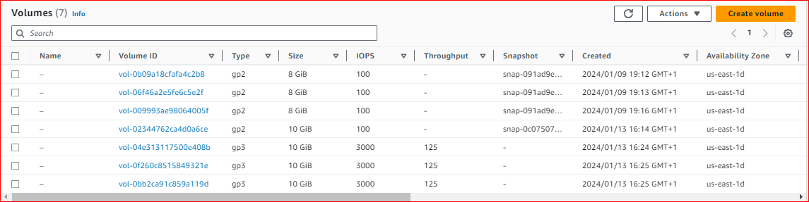
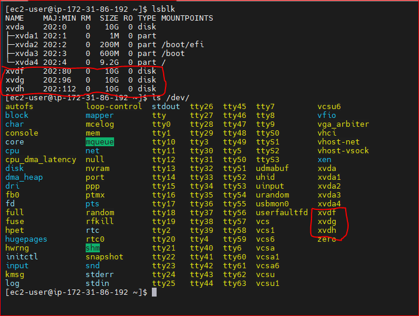
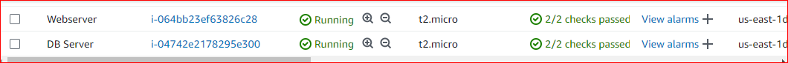

# IMPLEMENTING WORDPRESS WEBSITE WITH LOGIC VOLUME MANAGEMENT (LVM) STORAGE MANAGEMENT.

## Implementing LVM on Linux Servers (Web and Database Servers)

**Step 1:** Prepare a Web Server.

- Launch an EC2 instance that will serve as "Web Server"

- Launching an EC2 Instance called Web-Server with a Redhat OS

- Create 3 Volumes in the same Availability Zone (AZ) as your Web server EC", each of 10gigs



- To attach each Volume one by one to the Webserver EC2 Instance

- Click on the Volume and right click to select the attach option.

- Select the Web-server EC2 instance and click attach

**Step 2:** Open up the linux terminal to begin configuration.

** Step 3:** Use `lsblk` command to inspect what block devices are attached to the webserver. All devices in Linux reside in `/dev/` directory. Inspect this directory using the command `ls /dev/` and confirm you see all 3 newly created block devices there.

_Their names will likely be `xvdf`, `xvdh`, `xvdg`._



**Step 4:** Use `df -h` command to see all mounts and free space on your server.


**Step 5:** Use `gdisk` utility to create a single partition on each of the 3 disks using the command sudo gdisk `/dev/xvdf`


Use `lsblk` utility to view the newly configured partition on each of the 3 disks.


**Step 6:** Install LVM2 package using the command `sudo yum install lvm2`.


Run `sudo lvmdiskscan` command to check for available partitions.


**Step 7:** Use `pvcreate` utility to mark each of 3 disks as physical volumes (PVs) to be used by LVM

```
sudo pvcreate /dev/xvdf1
sudo pvcreate /dev/xvdg1
sudo pvcreate /dev/xvdh1
```


**Step 8:** Verify that your physical volume has been created successfully by running `sudo pvs`


**Step 9:** Use `vgcreate` utility to add all 3 PVs to a volume group (VG). Name the VG webdata-vg

`sudo vgcreate webdata-vg /dev/xvdh1 /dev/xvdg1 /dev/xvdf1`

Verify that the VG created successfully by running the command `sudo vgs`


**Step 10:** Use `lvcreate` utility to create 2 logical volumes. apps-lv and logs-lv which will be used to store website data and log data respectively.

`sudo lvcreate -n apps-lv -L 13G webdata-vg`
`sudo lvcreate -n logs-lv -L 13G webdata-vg`


**Step 11:** Verify that your Logical Volume has been created successfully by running `sudo lvs`


**Step 12:** Verify the entire setup

```
sudo vgdisplay -v #view complete setup - VG, PV, and LV
sudo lsblk
```


**Step 13:** Use `mkfs.ext4` to format the logical volumes with ext4 filesystem

`sudo mkfs -t ext4 /dev/webdata-vg/apps-lv`
`sudo mkfs -t ext4 /dev/webdata-vg/logs-lv`


**Step 14:** Create **/var/www/thml** directory to store website files

`sudo mkdir -p /var/www/html`

**Step 15:** Create **/home/recovery/logs** to store backup of log data

`sudo mkdir -p /home/recovery/logs`

**Step 16:** Mount **/var/www/html** on apps-lv logical volume

`sudo mount /dev/webdata-vg/apps-lv /var/www/html/`


**Step 17:** Use `rsync` utility to backup all the files in the log directory **/var/log** into **/home/recovery/logs** (This is required before mounting the file system)

`sudo rsync -av /var/log/. /home/recovery/logs/`


**Step 18:** Mount **/var/log** on **logs-lv** logical volume. (Note that all the existing data on /var/log will be deleted. That is why step 15 above is very important)

`sudo mount /dev/webdata-vg/logs-lv /var/log`

Step 19: Restore log files back into **/var/logs** directory

`sudo rsync -av /home/recovery/logs/. /var/log`


**Step 20:** Update **/etc/fstab** file so that the mount configuration will persist after restart of the server. The UUID of the device will be used to update the **/etc/fstab** file;

`sudo blkid`


Update `/etc/fstab` in this format using your own UUID and remember to remove the leading and ending quotes.

`sudo vi /etc/fstab`

```
logs: UUID= f0cda968-d0d0-4b16-9624-82415b6c9d7a /var/log      ext4 defaults 0 0

app: UUID= 58ecdbc4-5c35-476d-9b8e-ca7e53a3b462 /var/www/html ext4 defaults 0 0
```


**Step 21:** Test the configuration and reload the daemon

`sudo mount -a`

`sudo systemctl daemon-reload`

**Step 22:** Verify your setup by running `df -h`. The output will look like in the below screenshot.


## Installing WordPress and configuring it to use MySQL Database

**Step 1**

- Preparing the database Server

- Repeating the same step above, BUt instead of apps-lv create db-lv and mount it into directory /db instead of /var/www/html

- Launch an EC2 instance DB-serveron redhart OS



- Create and attach 3-volumes to the DB-Server


**Step 2:** Open up the linux terminal to begin configuration.

**Step 3:** Use `lsblk` command to inspect what block devices are attached to the webserver. All devices in Linux reside in `/dev/` directory. Inspect this directory using the command ls `/dev/` and confirm you see all 3 newly created block devices there.

_Their names will likely be `xvdf`, `xvdh`, `xvdg`._


**Step 4:** Use `df -h` command to see all mounts and free space on your server.


**Step 5:** Use `gdisk` utility to create a single partition on each of the 3 disks using the command sudo.

```
sudo gdisk /dev/xvdf
sudo gdisk /dev/xvdh
sudo gdisk /dev/xvdg
```


Use `lsblk` utility to view the newly configured partition on each of the 3 disks.


**Step 6:** Install LVM2 package using the command `sudo yum install lvm2`.

Run sudo `lvmdiskscan` command to check for available partitions.


**Step 7:** Use `pvcreate` utility to mark each of 3 disks as physical volumes (PVs) to be used by LVM

```
sudo pvcreate /dev/xvdf1
sudo pvcreate /dev/xvdg1
sudo pvcreate /dev/xvdh1
```


**Step 8:** Verify that your physical volume has been created successfully by running `sudo pvs`


**Step 9:** Use `vgcreate` utility to add all 3 PVs to a volume group (VG). Name the VG webdata-vg

`sudo vgcreate webdata-vg /dev/xvdh1 /dev/xvdg1 /dev/xvdf1`

**Step 10:** Verify that the VG created successfully by running the command `sudo vgs`


**Step 11:** Use `lvcreate` utility to create 2 logical volumes. db-lv and logs-lv which will be used to store website data and log data respectively.

`sudo lvcreate -n db-lv -L 13G webdata-vg`

`sudo lvcreate -n logs-lv -L 13G webdata-vg`

**Step 12:** Verify that your Logical Volume has been created successfully by running `sudo lvs`


**Step 13:** Verify the entire setup

```
sudo vgdisplay -v #view complete setup - VG, PV, and LV
sudo lsblk
```


Step 14: Use `mkfs.ext4` to format the logical volumes with ext4 filesystem

`sudo mkfs -t ext4 /dev/webdata-vg/db-lv`

`sudo mkfs -t ext4 /dev/webdata-vg/logs-lv`


**Step 15:** Create /var/www/html directory to store website files

`sudo mkdir -p /db`

**Step 16:** Create /home/recovery/logs to store backup of log data

`sudo mkdir -p /home/recovery/logs`

**Step 17:** Mount /var/www/html on apps-lv logical volume

`sudo mount /dev/webdata-vg/db-lv /db/`

Step 18: Use `rsync` utility to backup all the files in the log directory /var/log into /home/recovery/logs (This is required before mounting the file system)

`sudo rsync -av /var/log/. /home/recovery/logs/`


**Step 19:** Mount /var/log on logs-lv logical volume. (Note that all the existing data on /var/log will be deleted. That is why step 15 above is very important)

`sudo mount /dev/webdata-vg/logs-lv /var/log`

**Step 20:** Restore log files back into /var/logs directory

`sudo rsync -av /home/recovery/logs/. /var/log`

**Step 21:** Update `/etc/fstab file so that the mount configuration will persist after restart of the server. The UUID of the device will be used to update the `/etc/fstab` file.

`sudo blkid`


Update `/etc/fstab` in this format using your own UUID and remember to remove the leading and ending quotes.

`sudo vi /etc/fstab`

```
DB: UUID=04ece21a-1584-4702-b04a-f9ddc31f8f1c /db ext4 defaults 0 0

log: UUID=5ed5ccf0-9321-4ef5-be4e-4a50dc012df9 /var/log ext4 defaults 0 0
```


**Step 22:** Test the configuration and reload the daemon

`sudo mount -a`

`sudo systemctl daemon-reload`

**Step 23:** Verify your setup by running `df -h`.


## Install Wordpress on the Webserver EC2 Instance

1. Update the repository `sudo yum -y update`

2. Install wget, Apache and it's dependencies `sudo yum -y install wget httpd php php-mysqlnd php-fpm php-json`


3. Start Apache

`sudo systemctl enable httpd`

`sudo systemctl start httpd`

4. Install PHP and it's dependencies

```
sudo yum install https://dl.fedoraproject.org/pub/epel/epel-release-latest-8.noarch.rpm
sudo yum install yum-utils http://rpms.remirepo.net/enterprise/remi-release-8.rpm
sudo yum module list php
sudo yum module reset php
sudo yum module enable php:remi-7.4
sudo yum install php php-opcache php-gd php-curl php-mysqlnd
sudo systemctl start php-fpm
sudo systemctl enable php-fpm
sudo setsebool -P httpd_execmem 1
```


5. Restart Apache `sudo systemctl restart httpd`

6. Download wordpress and copy wordpress to `/var/www/html`

```
mkdir wordpress
cd   wordpress
sudo wget http://wordpress.org/latest.tar.gz
sudo tar xzvf latest.tar.gz
sudo rm -rf latest.tar.gz
sudo cp wordpress/wp-config-sample.php wordpress/wp-config.php
sudo cp -R wordpress /var/www/html/
```


7. Configure SE Linux Policies

```
sudo chown -R apache:apache /var/www/html/wordpress
sudo chcon -t httpd_sys_rw_content_t /var/www/html/wordpress -R
sudo setsebool -P httpd_can_network_connect=1
```


## Install MySQL on the DB Server EC2 Instance

1. Install MySQL on the DB Server EC2 Instance

```
sudo yum update
sudo yum install mysql-server
```


Verify the service is up and running using `sudo systemctl status mysqld`. If it is not runnning, restart the service and enable it so it will be running even after reboot.

`sudo systemctl restart mysqld`
`sudo systemctl enable mysqld`


2. Configure DB to work with WordPress

```
sudo mysql
CREATE DATABASE wordpress;
CREATE USER 'chidi'@`172.31.86.192` IDENTIFIED BY 'password';
GRANT ALL ON wordpress.* TO 'chidi'@'172.31.86.192';
FLUSH PRIVILEGES;
SHOW DATABASES;
exit
```


## Configure WordPress to connect to remote database

Do not forget to open MySQL port `3306` on DB Server EC2. For extra security, we will allow access to the DB server ONLY from our Webserver's IP address, so in the inbound rule configuration specify source as `/32`


1. Install MySQL client and test that we can connect from our webserver to our DB server by using `mysql-client`

`sudo yum install mysql`
`sudo mysql -u ec2-user -p -h 172.31.84.46`

2. Verify if we can successfully execute `SHOW DATABASES`; command and see a list of existing databases.


- cd into `/var/www/html` directory and `ls`

- cd into `wordpress` and `ls`

- Run `sudo vi wp-config.php` and edit accordingly


- Restart mysql on DB-server `sudo systemctl restart mysqld`

3. Try to access from your browser the link to your WordPress `http://34.201.57.87/wordpress/`. We can see the WordPress welcome page from the screenshot below


- After filling in the required details you should have the below


# PROJECT COMPLETED
