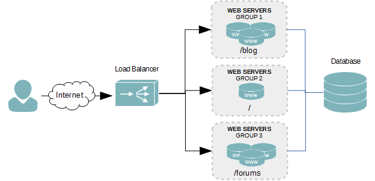
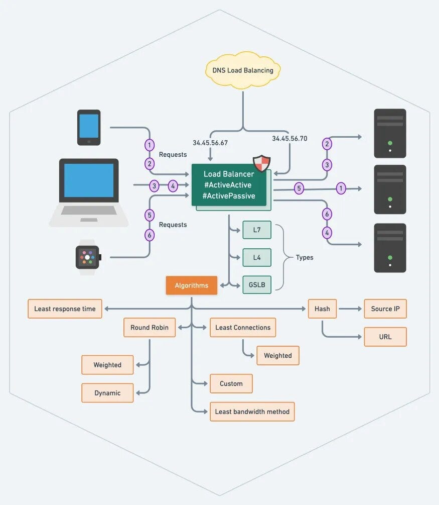

## WHAT IS A LOAD BALANCER?
A load balancer enables distribution of network traffic dynamically across resources (on-premises or cloud) to support an application.

A load balancer is a solution that acts as a traffic proxy and distributes network or application traffic across endpoints on a number of servers. Load balancers are used to distribute capacity during peak traffic times, and to increase reliability of applications. They improve the overall performance of applications by decreasing the burden on individual services or clouds, and distribute the demand across different compute surfaces to help maintain application and network sessions.

Modern applications must process millions of sessions simultaneously and return the correct text, videos, images, and other data to each user in a fast and reliable manner. To handle such high volumes of traffic, most applications have many resource servers with duplicate data among them.

## BENEFITS OF LOAD BALANCER
A load balancer is a solution that acts as a traffic proxy and distributes network or application traffic across endpoints on a number of servers. Load balancers are used to distribute capacity during peak traffic times, and to increase reliability of applications. They improve the overall performance of applications by decreasing the burden on individual services or clouds, and distribute the demand across different compute surfaces to help maintain application and network sessions. 

Modern applications must process millions of sessions simultaneously and return the correct text, videos, images, and other data to each user in a fast and reliable manner. To handle such high volumes of traffic, most applications have many resource servers with duplicate data among them.

Load balancing distributes network traffic dynamically across a network of resources that support an application. A load balancer is the device or service that sits between the user and the server group and acts as an invisible facilitator, ensuring that all resource servers are used equally. A load balancer helps increase reliability and availability, even in times of high usage and demand, and ensures more uptime and a better user experience.

In some cases, it is essential that all requests from a client are sent to the same server for the duration of a session, for example when a client is putting items in a shopping cart and then completing the purchase. Maintaining the connection between client and server is known as session persistence. Without session persistence, information has to be synchronized across servers and potentially fetched multiple times, creating performance inefficiencies.

Benefits of Load Balancing
Users and customers depend on near-real-time ability to find information and conduct transactions. Lag time or unreliable and inconsistent responses—even during peak demand and usage times—can turn a customer away forever. And high spikes in compute need can cause havoc to an internal server or server system if the incoming demand—or “load”—is too high to be easily accommodated. 

* Application availability: Users both internal and external need to be able to rely on application availability. If an application or function is down, lagging, or frozen, precious time is lost—and a potential source of friction is introduced that might drive a customer to a competitor.

* Application scalability: Imagine you run a ticketing company, and tickets for a popular performance are announced to be available at a certain date and time. There could be thousands or even more people trying to access your site to buy tickets. Without a load balancer, your site would be limited to whatever your single/first server can accommodate—which likely won’t be much with that much demand. Instead, you can plan for this big spike in traffic by having a load balancer to direct requests and traffic to other available compute surfaces. And that means more customers can get their desired tickets.
* Application security: Load balancing also lets organizations scale their security solutions. One of the primary ways is by distributing traffic across multiple backend systems, which helps to minimize the attack surface and makes it more difficult to exhaust resources and saturate links. Load balancers can also redirect traffic to other systems if one system is vulnerable or compromised. In addition, load balancers can offer an extra layer of protection against DDoS attacks by rerouting traffic between servers if a particular server becomes vulnerable.
* Application performance: By doing all of the above, a load balancer boosts application performance. By increasing security, by optimizing uptime, and by enabling scalability through spikes in demand, load balancers keep your applications working as designed—and the way you, and your customers, want them to.
  

## LOAD BALANCING ALGORITHMS

There are two types of load-balancing algorithms in terms of how they operate: static and dynamic. Static load balancing measures the incoming load on a server using algorithms that have performance capacity information about the existing servers in the distributed network. Dynamic load balancing can dynamically identify the amount of load that needs to be shed during runtime and which system should bear the load.  It is designed for systems with high fluctuation in incoming load.

The following are some of the common types of load balancing algorithms.

* Round robin: This algorithm sends traffic to a list of servers in rotation using the Domain Name System (DNS). (Note: DNS load balancing can also be a dynamic solution.)
* Threshold: This algorithm distributes tasks based on a threshold value that is set by the administrator.
* Random with two choices: The “power of two” algorithm selects two servers at random and sends the request to the one that is selected by then applying the Least Connections algorithm or the Least Time algorithm, if so configured.
* Least connections: A new request is sent to the server with the fewest current connections to clients. The relative computing capacity of each server is factored into determining which one has the least connections or which is using the least amount of bandwidth or resources.
* Least time: In this algorithm, a request is sent to the server selected by a formula that combines the fastest response time and fewest active connections. 
* URL hash: This algorithm generates a hash value based on the URL present in client requests. The requests are forwarded to servers based on the hash value. The load balancer caches the hashed value of the URL, so subsequent requests that use the same URL result in a cache hit and are forwarded to the same server.
* Source IP hash: This algorithm uses the client’s source and destination IP addresses to generate a unique hash key to tie the client to a particular server. As the key can be regenerated if the session disconnects, this allows reconnection requests to get redirected to the same server used previously.
* Consistent hashing: This algorithm maps both clients and servers onto a ring structure, with each server assigned multiple points on the ring based on its capacity. When a client request comes in, it is hashed to a point on the ring, and is then dynamically routed clockwise to the next available server.
  
## DIFFERENT TYPES OF LOAD BALANCERS

Different types of load balancers with different capabilities reside in the architecture called the Open System Interconnection (OSI) model. In this model are seven layers. Network firewalls are at levels one to three (L1-physical wiring, L2-data link and L3-network). Meanwhile, load balancing happens at layers four to seven (L4-transport, L5-session, L6-presentation and L7-application). Load balancers are generally used at Layer 4 and Layer 7. 

* Layer 4 load balancers direct traffic based on data from network and transport layer protocols (IP, TCP, FTP, UDP). Load balancing at the IP layer refers to a deployment where the load balancer’s IP address is the one advertised to clients for a website, and therefore recorded as the destination address. When the load balancer gets the request, it changes the recorded destination IP address to that of the content server it has chosen.
* Layer 7 load balancers distribute requests based upon data found in application layer protocols such as HTTP headers, cookies, uniform resource identifier, SSL session ID, and HTML form data. They also enable routing decisions based on data within the application message itself, such as the value of a specific parameter. Layer 7 adds content switching to load balancing.